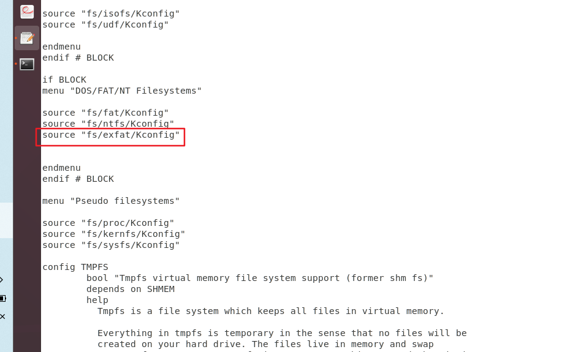

# 记录使用USB-OTG把ARM(IMX6ULL)板模拟成U盘并且和挂载大容量U盘

## 暂时没解决的问题

1、挂载U盘的权限好像只有root才有读写权限，其他的只有读和执行的权限。并且读写存在时间差，写入之后，PC端好像无法看到实时的数据

2、还有就是其他功能

3、驱动这块需要自动挂载 我需要了解这些都是干啥的，以及怎么自动化。

4、驱动好像会导致死机，有时使用mout之后会导致断网，ping ubuntu虚拟机不通。

5、

## 最重要的是首先搭网络环境方便连接开发板

 这一步如果整不好 接下来都很难整-扯淡

## 挂载U盘的方法

参考：

[在内核中添加USB接口设备（U盘）驱动_usb设置menuconfig_庄山浪水的博客-CSDN博客](https://blog.csdn.net/c_group/article/details/89258755)

正点原子的I.MX6U 嵌入式 Linux 驱动开发指南

### 首先针对挂载U盘进行记录 无法挂载exfat文件系统的u盘

挂载的U盘是`exFAT`文件系统的，在ubuntu环境下需要进行读写操作。由于linux 4.9.88内核版本没有集成这个exfat文件系统的驱动，更高版本存在。所需需要我向linux内核添加exfat驱动。

参考方法：

[（实例）Linux 内核添加exfat驱动 - schips - 博客园 (cnblogs.com)](https://www.cnblogs.com/schips/p/12305534.html)

[imx6ull内核添加exfat,并自动开机加载_exfat源码_云淡风轻。的博客-CSDN博客](https://blog.csdn.net/qq_32605451/article/details/128612879#:~:text=%E5%B0%86%E7%94%9F%E6%88%90%E7%9A%84exfa,ko%E7%9B%B8%E5%85%B3%E7%9A%84%E5%AD%97%E7%AC%A6%E3%80%82) 

#### 遇到的问题

**遇到的最大的问题在于误用指令清除配置文件make mrproper**。

**其次就是生成的exfat.ko文件一直在`fs/exfat/`目录下面，我就是不知道，以为系统会自动把ko文件放到特定的模块文件下面，实际不是**

我自己的做法：

1、下载[exfat](https://github.com/dorimanx/exfat-nofuse)源码（将源码目录名称设置成exfat方便修改），将其放到内核的`fs`目录下，源码的目录是: 

```shell
book@100ask:~/100ask_imx6ull_mini-sdk/Linux-4.9.88/fs$
```

具体的操作是如下：

```shell
#1、首先我的源码位置在桌面
book@100ask:~/Desktop/workspace$ ls
exfat-nofuse-master  exfat-nofuse-master.zip  hello  test.txt  usb.c
# 2、把已经解压的文件改名为exfat并且使用cp命令复制到源码的fs
book@100ask:~/Desktop/workspace$ 
cp -r exfat-nofuse-master ~/100ask_imx6ull_mini-sdk/Linux-4.9.88/fs/
# 3、然后切换到fs的目录下面查看就可以相关源码了
book@100ask:~/100ask_imx6ull_mini-sdk/Linux-4.9.88/fs$ ls 
 exfat-nofuse-master ...
```

2、然后修改fs目录下面的Kconfig文件 

```shell
book@100ask:~/100ask_imx6ull_mini-sdk/Linux-4.9.88/fs$ 
sudo gedit Kconfig
```



3、然后修改fs目录下面 `Makefile`的文件

```shell
book@100ask:~/100ask_imx6ull_mini-sdk/Linux-4.9.88/fs$ 
sudo gedit Makefile 
```


4、然后切回到源码的目录`/100ask_imx6ull_mini-sdk/Linux-4.9.88/`下面使用`make menuconfig`选中刚才添加的需要编译的文件。第4步和第3步是一样的操作，但是我就是两者多用了。

```shell
book@100ask:~/100ask_imx6ull_mini-sdk/Linux-4.9.88/$ 
make menuconfig
```

选择

   File systems  --->       

            DOS/FAT/NT Filesystems --->

                    < M > exFAT fs support  # 其余的还在学习中 


5、选择完成之后保存，然后编译内核即可。这一步就可迷惑 我不会编译内核导致就有问题

编译内核之前 我一直先使用`make mrproper` 这个命令导致清除了一些配置文件。编译内核部分就一直没有xxx.ko文件。到现在这个命令是干啥的我还不知道。待查。

编译内核部分所需的命令如下

前提是先使用

1、make mrproper

2、make 100ask_imx6ull_mini_defconfig 

3、然后才是 make menuconfig 选择需要添加的驱动。

4、make zImage -j4  

5、make modules                                                                  编译内核模块

编译完成之后去`fs/exfat/`目录下面查看exfat.ko文件 


然后把编译完成的模块复制到我需要挂载到开发板的文件目录下，然后使用tree看对应的文件目录下

```shell
book@100ask:~/100ask_imx6ull_mini-sdk/Linux-4.9.88/fs/exfat$ 
cp exfat.ko ~/nfs_rootfs/lib/modules/4.9.88/kernel/fs/exfat/
```

```c
book@100ask:~/nfs_rootfs/lib/modules/4.9.88/kernel/fs$ tree
.
├── binfmt_misc.ko
├── exfat
│   └── exfat.ko
├── fat
│   └── msdos.ko
├── isofs
│   └── isofs.ko
├── nls
│   └── nls_iso8859-15.ko
└── udf
    └── udf.ko

5 directories, 6 files
```

随后在开发板中对应的目录下面执行，可以用 lsmod 查看哪些模块已经启动

```shell
[root@100ask:/mnt/lib/modules/4.9.88/kernel/fs/exfat]# insmod exfat.ko
[ 3406.921126] exFAT: Version 1.2.9
```

然后挂载U盘，并且给读写权限，权限不是全部的

mount   -t  exfat      /dev/sda4   /mnt_test

显示的权限如下：

`-rwxr-xr-x    1 root     root           451 Sep  8  2023 error_log.txt`

## 此时使用USB-OTG的方式把开发板模拟成U盘的形式

#### 遇到的问题

**使用make menuconfig配置之后我不知道为啥命令一通乱用导致配置文件被删除。编译模块的时候就无法根据配置文件生成ko问价。**

**还有就是生成的ko文件我不知道在哪。还不知道咋执行这些模块文件**，就是睁眼瞎 艹

#### 参考资料：

正点原子 I.MX6U 嵌入式 Linux 驱动开发指南

[荔枝派zero USB gadget Mass Storage设置总结（调试成功） / 全志 SOC / WhyCan Forum(哇酷开发者社区)](https://whycan.com/t_4195.html)

[利用USB OTG把ARM板（瑞芯微RK3399+Linux）模拟为U盘_linux usb otg_鸣睿家多宝的博客-CSDN博客](https://blog.csdn.net/stevenqian/article/details/127224086) 这个和原子的很详细

[DesignWare USB2 DRD Core Support - CONFIG_USB_DWC2 - dwc2.ko - kernelconfig.io](https://www.kernelconfig.io/config_usb_dwc2)

下面是我的操作

在1和2两个命令之下进行操作的

1、make mrproper

2、make 100ask_imx6ull_mini_defconfig

在源码目录下面执行 `make menuconfig` 配置usb相关

```c
Linux Kernel Configuration

    Device Drivers  ---> 

       [*] USB support  ---> 

            < * > DesignWare USB2 DRD Core Support 

                    DWC2 Mode Selection (Dual Role mode) --->
```


如图所示：

然后配置USB Gadget 相关的，随后我在细查这些都是干啥的

```c
<*>   USB Gadget Support  ---> 
      --- USB Gadget Support
      (500) Maximum VBUS Power usage (2-500 mA)
       (2)   Number of storage pipeline buffers
       <M>   USB functions configurable through configfs
       <M>   USB Gadget Drivers
       [*]   Mass storage
       <M>   Gadget Filesyste
       < >   Function Filesystem
       <M>   Mass Storage Gadget 
```

如图所示：


选择完配置之后就可以编译内核了，编译完就可以在对应的驱动目录下面看到xxx.ko文件

4、make zImage -j4

5、make modules                                                                 编译内核模块

就得到了四个文件-源码目录为 100ask_imx6ull_mini-sdk/Linux-4.9.88/

drivers/usb/gadget/libcomposite.ko

 drivers/usb/gadget/legacy/gadgetfs.ko  原子的教程没说这条指令 反正我使用了

drivers/usb/gadget/function/usb_f_mass_storage.ko

drivers/usb/gadget/legacy/g_mass_storage.ko

使用tree 查看层次结构

```c
book@100ask:~/100ask_imx6ull_mini-sdk/Linux-4.9.88/drivers/usb$ 
tree gadget/
```

然后将生成的ko文件分别复制到对应的文件目录下面

```c
book@100ask:~/nfs_rootfs/lib/modules/4.9.88/kernel/drivers/usb$ tree
.
├── gadget
│   ├── function
│   │   └── usb_f_mass_storage.ko 
│   ├── legacy
│   │   ├── g_acm_ms.ko
│   │   ├── gadgetfs.ko
│   │   ├── g_cdc.ko
│   │   ├── g_ether.ko
│   │   ├── g_mass_storage.ko
│   │   ├── g_multi.ko
│   │   ├── g_ncm.ko
│   │   ├── g_serial.ko
│   │   └── g_zero.ko
│   └── libcomposite.ko
├── misc
│   └── usbtest.ko
├── serial
│   ├── cp210x.ko
│   └── ftdi_sio.ko
└── storage
    ├── uas.ko
    ├── ums-alauda.ko
    ├── ums-eneub6250.ko
    ├── ums-jumpshot.ko
    ├── ums-karma.ko
    ├── ums-onetouch.ko
    ├── ums-realtek.ko
    ├── ums-sddr09.ko
    └── ums-sddr55.ko

6 directories, 23 files
```

使用以下命令就可以复制过去，改建立对应的文件夹就是要mkdir建立

```c
// 切换到这个目录下
// ~/100ask_imx6ull_mini-sdk/Linux-4.9.88/drivers/usb/gadget$ 
// 执行
cp libcomposite.ko ~/nfs_rootfs/lib/modules/4.9.88/kernel/drivers/usb/gadget/
// 切换到
// ~/100ask_imx6ull_mini-sdk/Linux-4.9.88/drivers/usb/gadget/legacy$
cp gadgetfs.ko ~/nfs_rootfs/lib/modules/4.9.88/kernel/drivers/usb/gadget/legacy/
cp g_mass_storage.ko ~/nfs_rootfs/lib/modules/4.9.88/kernel/drivers/usb/gadget/legacy/

// 切换到
// ~/100ask_imx6ull_mini-sdk/Linux-4.9.88/drivers/usb/gadget/function$
// 执行
 cp usb_f_mass_storage.ko ~/nfs_rootfs/lib/modules/4.9.88/kernel/drivers/usb/gadget/function/
```

然后就可以了。随后使用挂载指令在这些个文件挂载到开发板当中使用就行了。

执行的结构如下

```
使用insmod 加载模块

insmod exfat.ko加载exfat的文件系统的驱动

然后还有 mount -t exfat /dev/sda4 /mnt_usb
然后指向 
1、[root@100ask:/lib/modules/4.9.88/kernel/drivers/usb/gadget]# 
insmod libcomposite.ko
2、[root@100ask:/lib/modules/4.9.88/kernel/drivers/usb/gadget/legacy]# 
insmod gadgetfs.ko
3、[root@100ask:/lib/modules/4.9.88/kernel/drivers/usb/gadget/function]# 
insomd usb_f_mass_storage.ko

 这样就暂时解决了我的问题
```


记录一下问题和方法--9.10
